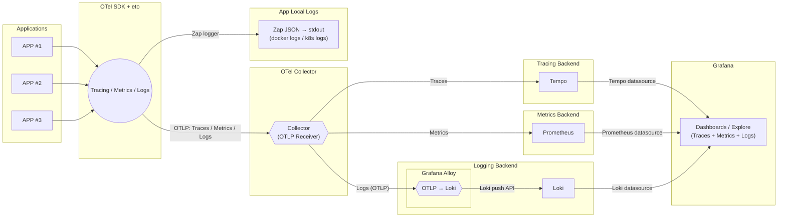

# otelgo
- APP ทุกตัวใช้ otelgo → ส่ง Traces/Metrics/Logs ออกเป็น OTLP
- ทุกอย่างยิงไปที่ OTel Collector ตัวเดียว
- Collector แยกเอา:
- Traces → Jaeger / Tempo
- Metrics → Prometheus → Grafana
- Logs → zap → alloy → Loki
