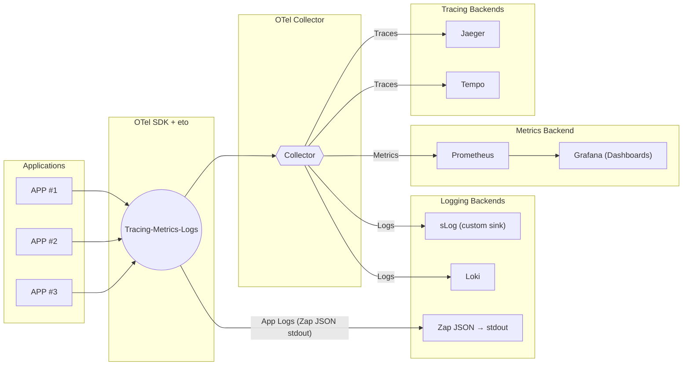

# otelgo
- APP ทุกตัวใช้ otelgo → ส่ง Traces/Metrics/Logs ออกเป็น OTLP
- ทุกอย่างยิงไปที่ OTel Collector ตัวเดียว
- Collector แยกเอา:
- Traces → Jaeger / Tempo
- Metrics → Prometheus → Grafana
- Logs → sLog / Loki (หรือส่งต่อไป Alloy / Agent ก่อนก็ได้)
- ส่วน Zap เป็น logger ใน app → พ่น JSON ลง stdout แล้วให้ Alloy/Promtail ดึงเข้า Loki อีกที
