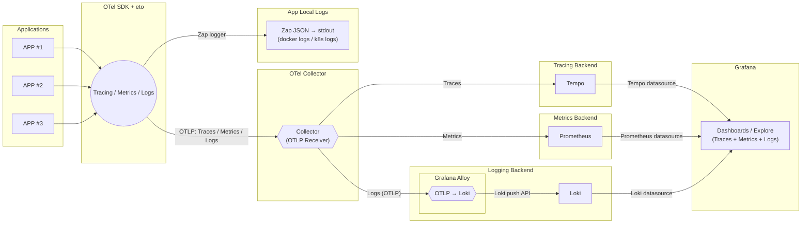

# otelgo
- APP ทุกตัวใช้ otelgo → ส่ง Traces/Metrics/Logs ออกเป็น OTLP
- ทุกอย่างยิงไปที่ OTel Collector ตัวเดียว
- Collector แยกเอา:
- Traces → Jaeger / Tempo
- Metrics → Prometheus → Grafana
- Logs → zap → alloy → Loki



#### ติดตั้ง
```console
go get github.com/Maximumsoft-Co-LTD/otelgo
```

#### เรียกใช้งาน
```go
package main

import (
    "github.com/Maximumsoft-Co-LTD/otelgo/eto"
)
```

#### เริ่มต้นใช้งาน
main.go
```go
package main

import (
	"github.com/Maximumsoft-Co-LTD/otelgo/eto"
)

func main() {
	ctx, cancel := context.WithTimeout(context.Background(), 10*time.Second)
	defer cancel()
	
	shutdown, err := eto.Init(ctx, eto.Config{
		ServiceName:  "example",
		Environment:  "dev",
		OtelEndpoint: "otel-collector:4317",
		SkipCallerPkgs: []string{"example/internal/utils"},
		SkipCallerFiles: []string{},
	})
	if err != nil {
		log.Fatalf("eto init error: %v", err)
	}
	defer shutdown(context.Background())
}
```

middleware/otelgo.go
```go
package middleware

import (
	"github.com/Maximumsoft-Co-LTD/otelgo/eto"
	"github.com/gin-gonic/gin"
	"go.opentelemetry.io/otel/trace"
)

func OTELMiddleware() gin.HandlerFunc {
	return func(c *gin.Context) {
		ctx := eto.Propagate().FromHTTPRequest(c.Request)

		ctx, span := eto.Trace().
			Name(c.FullPath()).
			FromContext(ctx).
			Kind(trace.SpanKindServer).
			Attr("http.method", c.Request.Method).
			Attr("http.route", c.FullPath()).
			Start()
		defer span.End()

		c.Request = c.Request.WithContext(ctx)

		c.Next()

		eto.Propagate().
			FromContext(ctx).
			ToHTTPResponse(c.Writer)
	}
}
```

utils/otelgo.go (สร้างเป็น helper ไว้ใช้ใน project)
```go
package utils

import (
	"context"

	"github.com/Maximumsoft-Co-LTD/otelgo/eto"
	"go.opentelemetry.io/otel/trace"
)

type MetricType string

const (
	MetricCounter   MetricType = "counter"
	MetricHistogram MetricType = "histogram"
)

type LogLevel string

const (
	LogLevelInfo  LogLevel = "info"
	LogLevelWarn  LogLevel = "warn"
	LogLevelError LogLevel = "error"
)

func Trace(ctx context.Context, name string, attbs map[string]any) (context.Context, trace.Span) {
	builder := eto.Trace().
		FromContext(ctx).
		Name(name)

	for k, v := range attbs {
		builder = builder.Attr(k, v)
	}

	newCtx, span := builder.Start()
	return newCtx, span
}

func Metric(ctx context.Context, metricType MetricType, name string, value any) {
	var (
		intVal   int64
		floatVal float64
	)

	switch v := value.(type) {
	case int:
		intVal = int64(v)
		floatVal = float64(v)
	case int64:
		intVal = v
		floatVal = float64(v)
	case float32:
		floatVal = float64(v)
	case float64:
		floatVal = v
	default:
		return
	}

	switch metricType {
	case MetricCounter:
		eto.MetricCounter(name).Add(ctx, intVal)

	case MetricHistogram:
		eto.MetricHistogram(name).Record(ctx, floatVal)
	}
}

func Log(ctx context.Context, logLevel LogLevel, msg string, attbs map[string]any) {
	logger := eto.Log().
		FromContext(ctx).
		Msg(msg)

	switch logLevel {
	case LogLevelInfo:
		logger = logger.Info()
	case LogLevelWarn:
		logger = logger.Warn()
	case LogLevelError:
		logger = logger.Error()
	default:
		logger = logger.Debug()
	}

	if attbs != nil {
		for k, v := range attbs {
			logger = logger.Field(k, v)
		}
	}

	logger.Send()
}
```

